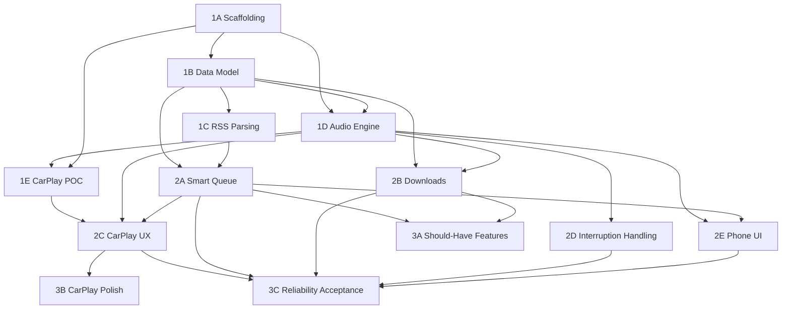

# hlyst Architecture

## 1. Introduction and Goals

### 1.1 Requirements Overview

Top-level functional, non-functional, and integration requirements driving architectural decisions. Full traceability in Appendix C.

| REQ-ID | Requirement | Priority |
|--------|-------------|----------|
| FR-01 | RSS Subscription Management | Must |
| FR-03 | Episode Feed Fetch & Background Refresh | Must |
| FR-05 | Episode Playback Core Controls | Must |
| FR-06 | Per-Subscription Playback Speed Persistence | Must |
| FR-07 | Episode Progress Persistence | Must |
| FR-08 | Background Audio Playback | Must |
| FR-09 | Episode Download for Offline Playback | Must |
| FR-11 | Smart Queue: Rules-Based Auto-Ordering | Must |
| FR-12 | Queue Rule: Duration-Based Sorting | Must |
| FR-15 | Queue Rule Transparency (Rule Attribution) | Must |
| FR-16 | Manual Queue Override (non-destructive) | Must |
| FR-17 | CarPlay Integration (Core Session) | Must |
| FR-18 | CarPlay Now Playing Controls (3-button) | Must |
| FR-19 | CarPlay Queue Browse (≤2 taps) | Must |
| FR-21 | AVAudioSession Interruption Handling | Must |
| FR-25 | Episode Played/Unplayed Tracking | Must |
| NFR-01 | 0 silent CarPlay failures across 30 sessions | Must |
| NFR-05 | Background queue re-evaluation before CarPlay | Must |
| NFR-07 | CarPlay CPTemplate system only — no custom views | Must |
| NFR-08 | ≤2 taps to common CarPlay actions | Must |
| NFR-09 | All local state survives restarts/crashes/kills | Must |

### 1.2 Quality Goals

| Priority | Quality Goal | Motivation |
|----------|-------------|------------|
| 1 | **CarPlay Reliability** — 0 silent playback failures across 30 consecutive sessions | Trust-destroying failure mode; makes the app unusable as a daily driver |
| 2 | **State Durability** — all local state survives every iOS lifecycle event | Losing position, speeds, or rules after a crash destroys trust immediately |
| 3 | **Queue Correctness** — smart queue surfaces preferred episode ≥80% without manual override | The product's core thesis; if the queue is wrong, the app fails its purpose |
| 4 | **CarPlay Interaction Depth** — ≤2 taps to common actions | CarPlay HIG mandate; in-car safety requirement |
| 5 | **Privacy** — no data egress beyond RSS and Podcast Index API | Local-first design principle; no account, no backend |

### 1.3 Stakeholders

| Role | Name | Expectations |
|------|------|--------------|
| Primary User / Developer | Jon Yurek | Daily driver adoption; zero pre-drive ritual; CarPlay reliability |
| Aspirational User | The Switcher (Persona B) | OPML migration; smart queue; CarPlay without paywall |
| Non-target User | Casual Car Listener (Persona C) | Reliable CarPlay; automatic downloads |

---

## 2. Architecture Constraints

| Type | Constraint | Rationale |
|------|-----------|-----------|
| Technical | Expo bare workflow required | Managed workflow incompatible with react-native-carplay's AppDelegate bridging (MADR-001) |
| Technical | iOS only in v1 | No Android, watchOS, or other targets |
| Technical | Local-first / no backend | All state on-device; no sync, no account, no server-side logic |
| Technical | CarPlay CPTemplate system only | Apple CarPlay HIG prohibits custom UIKit/SwiftUI views in CarPlay; CPTemplate tree is the only valid UI |
| Technical | AVAudioSession `.playback` category required | Mandatory for background audio and CarPlay; any other category causes silent failure on screen lock |
| Technical | react-native-track-player v4 for audio engine | Background service architecture with AVAudioSession management and Now Playing; expo-av is insufficient (MADR-002) |
| Technical | npm --legacy-peer-deps | React 19 causes peer dep conflicts with RN ecosystem packages |
| Platform | CarPlay entitlement must be requested from Apple | com.apple.developer.carplay-audio requires Apple review; simulator path available without approval |
| Design | ≤2-tap depth for common CarPlay actions | CarPlay HIG mandate binding for all CarPlay UI design |
| Design | 3-button limit on CPNowPlayingTemplate | Apple hardware constraint; all essential actions must fit |
| Architecture | RSS / Podcast Index as only external data sources | NFR-03 prohibits any other network calls |

---

## 3. System Scope and Context

### 3.1 Business Context

| Actor | Input | Output | Description |
|-------|-------|--------|-------------|
| Jon (primary user) | Podcast RSS URL, playback controls, queue rule config | Episode audio, queue state, rule attribution | Heavy podcast listener; daily commuter; developer-as-user |
| iOS / CarPlay head unit | Hardware connect/disconnect, audio session events | CarPlay UI (CPTemplate tree), Now Playing metadata | Primary in-car interface; enforces HIG constraints |
| RSS Feeds | HTTP RSS 2.0 + iTunes namespace | Subscription data, episode metadata, `<itunes:duration>` | Only external content source; polled on BGAppRefreshTask schedule |
| Podcast Index API | Search query | Podcast metadata (RSS feed URL) | Optional search-to-subscribe; Should-Have (M3) |
| iOS OS | BGAppRefreshTask fire, background kill, interruption events | Feed refresh, queue evaluation, audio session management | Platform scheduler; controls background execution budget |

### 3.2 Technical Context

| Channel / Interface | Protocol | Direction | Description |
|--------------------|----------|-----------|-------------|
| RSS feed fetch | HTTPS (HTTP polling) | Outbound | BGAppRefreshTask triggers serial fetches; 5-feed concurrency cap |
| Podcast Index API | HTTPS REST + HMAC-SHA1 auth | Outbound | Search-to-subscribe; API key embedded at build time |
| CarPlay bridge | CPTemplate native bridge (react-native-carplay) | Bidirectional | CPTemplate tree to CarPlay display; user actions back to audio/queue |
| AVAudioSession | iOS SDK (via RNTP) | Bidirectional | Audio category, interruption notifications, Now Playing metadata |
| Now Playing metadata | MPNowPlayingInfoCenter (via RNTP) | Outbound | Lock screen, Control Center, CarPlay Now Playing title/artwork |
| Background audio | RNTP headless JS service | Internal | Maintains playback state when app is backgrounded |
| Episode downloads | iOS Background URLSession | Outbound | Files to app Documents directory; survive app kill |
| BGAppRefreshTask | iOS OS | Inbound (OS fires) | Periodic background feed refresh; queue re-evaluation |

---

## 4. Solution Strategy

| Goal | Approach | Technology / Pattern |
|------|---------|---------------------|
| Background audio + CarPlay reliability | Purpose-built audio engine with correct AVAudioSession lifecycle | react-native-track-player v4 (headless service architecture) |
| Smart queue — rules-based, transparent | Explicit user-defined rules applied by a composable evaluator; ExceptionRegistry for manual pins | RuleEvaluator + DurationSortRule + ExceptionRegistry + EvaluationTrigger |
| CarPlay-native interface | Build from CPTemplate primitives; never port from phone UI | @g4rb4g3/react-native-carplay behind CarPlayBridge interface |
| Durable on-device state | Two-tier persistence matched to access pattern | expo-sqlite + Drizzle ORM (relational), MMKV (hot-path key-value) |
| Solo developer velocity | AI-directed code generation; minimal boilerplate | Expo bare workflow + EAS Build; Claude Code as primary dev toolchain |
| Local-first privacy | No backend, no auth, no analytics, no data egress | iOS sandbox; ATS enforced; NFR-03 compliance by architecture |
| CarPlay library risk mitigation | Abstract library behind internal interface | CarPlayBridge interface — library swappable without touching CarPlay UI code |

---

## 5. Building Block View

### 5.1 Level 1 — System Overview

#### Unit: 1A — Repository Scaffolding

**Purpose:** Establishes the Expo bare workflow repo, development toolchain, CI, and test infrastructure that all subsequent units build on.

**Responsibilities:**
- Expo bare workflow project initialization (TypeScript strict)
- ESLint + Prettier + Husky pre-commit hooks
- GitHub Actions CI (typecheck + lint on PR)
- Jest + React Native Testing Library infrastructure

**Deliverables:**
- Expo/RN project boots on iOS simulator
- All lint/type checks pass on clean repo
- CI pipeline runs green on first push
- Jest runs with coverage; first smoke test passes

**Dependencies:** None — no other units required.

---

#### Unit: 1B — Local Data Model & Storage

**Purpose:** Defines the on-device schema for all app state and establishes the two-tier persistence layer that every other unit reads and writes.

**Responsibilities:**
- TypeScript schema for Subscription, Episode, QueueEntry, PlaybackState, Rule, Settings, DownloadRecord
- expo-sqlite (with Drizzle ORM) for relational entity storage
- MMKV for hot-path key-value (playback position, per-show speed)
- Forward-only migration runner

**Deliverables:**
- Read/write round-trips pass; data survives kill+relaunch
- V1 migration runs clean; subsequent schema bump applies without data loss

**Dependencies:** 1A (project exists)

---

#### Unit: 1C — RSS Feed Parsing

**Purpose:** Fetches and parses RSS feeds into typed app models; schedules background refresh; enforces per-feed error isolation.

**Responsibilities:**
- RSS 2.0 + iTunes namespace parser (extracts `<itunes:duration>`)
- Per-feed error isolation (bad XML skipped; other feeds unaffected)
- BGAppRefreshTask registration + configurable refresh interval (default 30 min)
- Feed add/remove UI (phone)

**Deliverables:**
- 5 real-world feeds parse without error; duration field populated
- Bad XML feed skipped with logged error; other feeds unaffected (NFR-04)
- New episodes appear in library without app foregrounded (NFR-05 prerequisite)

**Dependencies:** 1B (Subscription, Episode types)

---

#### Unit: 1D — Audio Engine & Playback Foundation

**Purpose:** All audio playback, AVAudioSession lifecycle, Now Playing metadata, background audio, and playback state persistence.

**Responsibilities:**
- react-native-track-player v4 wired to AVAudioSession (`.playback` category)
- Background audio via RNTP headless service
- Now Playing metadata pushed to MPNowPlayingInfoCenter
- Per-show speed persistence (MMKV, applied on episode start)
- Episode progress persistence (MMKV, written on pause/background/termination)
- Episode played/unplayed tracking

**Deliverables:**
- Episode plays to completion; play/pause/seek/skip functional
- Audio continues on screen lock; appears in Control Center and Lock Screen
- Position within 2 seconds of actual after kill+relaunch (FR-07, NFR-09)
- Speed on podcast A does not affect podcast B; survives restart (FR-06)

**Dependencies:** 1A (project), 1B (PlaybackState, Episode types)

---

#### Unit: 1E — CarPlay Native Bridge POC

**Purpose:** Proves the CarPlay native module bridge before any CarPlay feature work, de-risking the highest-impact technical blocker.

**Responsibilities:**
- CarPlay entitlement provisioning (com.apple.developer.carplay-audio)
- react-native-carplay installation and AppDelegate bridging via config plugin
- Audio session CarPlay handoff validation

**Deliverables:**
- Entitlement present in Xcode build
- CPListTemplate with static test data renders on CarPlay simulator or device
- Audio continues across 3+ manual phone↔CarPlay transition cycles without silence

**Dependencies:** 1A (project), 1D (audio session active)

---

#### Unit: 2A — Smart Queue Engine

**Purpose:** The core product differentiator. Rules-based auto-ordering of the episode queue with manual override support and rule attribution labeling.

**Responsibilities:**
- DurationSortRule: sorts by `<itunes:duration>` ascending/descending
- ExceptionRegistry: stores manual pin positions as relative anchors ("before episodeId X")
- EvaluationTrigger: fires on background refresh completion, rule change, app foreground
- QueueStore: commits sorted QueueEntry[] to SQLite; fires Zustand update to UI

**Deliverables:**
- Queue ordered by duration after rule activation; direction toggle works (FR-12)
- Pinned episode stays put after queue re-evaluation; other episodes reorder (FR-16)
- "Shortest first" rule label visible per episode in queue list (FR-15)
- Queue sorted before user opens app after overnight refresh (NFR-05)

**Dependencies:** 1B (data model), 1C (episodes with duration populated)

---

#### Unit: 2B — Episode Downloads

**Purpose:** Offline episode playback via background download manager that survives app termination.

**Responsibilities:**
- Background URLSession download tasks with progress tracking
- RNTP track source routing: local file path preferred over remote URL
- Storage usage display in Settings
- Download state persistence across restart

**Deliverables:**
- Episode downloads in background; progress visible; survives app kill (FR-09)
- Downloaded episode plays without network in airplane mode (NFR-02)
- Settings screen shows "Downloaded: X MB"; matches filesystem reality

**Dependencies:** 1B (Episode, DownloadRecord models), 1D (RNTP track source)

---

#### Unit: 2C — CarPlay UX (Now Playing + Queue Browse)

**Purpose:** Production CarPlay interface — CPNowPlayingTemplate with 3 custom buttons and queue browse via CPListTemplate.

**Responsibilities:**
- CPNowPlayingTemplate wired to RNTP playback state
- 3 custom buttons: skip episode + advance queue, mark played, queue peek
- Queue browse CPListTemplate (title, podcast, duration; tap plays)
- CPTabBarTemplate root navigation (Now Playing + Queue tabs)
- Session lifecycle hardening across foreground↔background transitions

**Deliverables:**
- All 3 buttons functional; skip advances queue; mark played persists (FR-18)
- Queue list reachable from CarPlay home in ≤2 taps; tap-to-play works (FR-19, NFR-08)
- 10+ manual transition cycles: 0 audio drops (NFR-01 partial gate)

**Dependencies:** 1E (bridge proven), 1D (RNTP wired), 2A (queue available)

---

#### Unit: 2D — Interruption Handling & Reliability

**Purpose:** AVAudioSession interruption handling for navigation duck/resume, phone call pause/resume, and app state checkpoint on all lifecycle exit events.

**Responsibilities:**
- AVAudioSession interruption observer (navigation duck, call pause, auto-resume)
- Siri interruption handling (treated as transient; same observer)
- Background kill recovery — state checkpoint on `applicationWillResignActive`

**Deliverables:**
- Navigation prompt ducks audio; resumes automatically (FR-21, NFR-06)
- Call pauses audio; ≤1 tap resumes after call ends (NFR-06)
- Queue, position, speed, rules all intact after OS kill (NFR-09)

**Dependencies:** 1D (AVAudioSession registered)

---

#### Unit: 2E — Phone Player UI

**Purpose:** Full-screen phone player, queue list with rule attribution, and settings screen.

**Responsibilities:**
- Full-screen player (seek bar, speed picker, skip controls, artwork)
- Queue list (rule attribution labels; drag-to-reorder for manual pin)
- Settings (storage usage, refresh interval display)

**Deliverables:**
- All controls functional; speed change effective within 1 second (FR-05)
- Drag reorder creates exception; label updates on next evaluation (FR-15, FR-16)
- Storage display accurate; settings persist across restart

**Dependencies:** 1D (RNTP), 2A (queue + rule labels)

---

#### Unit: 3A — Should-Have Feature Completion

**Purpose:** Completes all Should-Have features: Podcast Index search, per-feed cadence, auto-download rules, staleness decay rule, sleep timer, chapter support, OPML import/export.

**Responsibilities:**
- Podcast Index API REST client + search → subscribe flow
- Per-subscription refresh cadence picker (15/30/60 min / manual)
- Auto-download rules (per-subscription toggle + retention count)
- StalenessDecayRule added to RuleEvaluator
- Sleep timer (AVAudioSession stop at set duration)
- Chapter marker parsing (ID3/MP4) + chapter UI
- OPML 2.0 import/export

**Deliverables:** All FR-02, FR-04, FR-10, FR-13, FR-23, FR-24, FR-26 acceptance criteria met.

**Dependencies:** 2A (queue engine for staleness), 2B (downloads for auto-download)

---

#### Unit: 3B — CarPlay Polish

**Purpose:** Subscription browse in CarPlay, artwork loading, cold-start depth audit, 30-session acceptance test.

**Responsibilities:**
- CPListTemplate: subscriptions → episodes → tap plays (FR-20)
- Artwork loading for CarPlay cells and Now Playing
- HIG depth audit (all common actions ≤2 taps confirmed)
- 30 consecutive full-commute CarPlay sessions logged

**Deliverables:** FR-20 complete; artwork visible; NFR-08 confirmed; NFR-01 gate reached.

**Dependencies:** 2C (CarPlay UX baseline)

---

#### Unit: 3C — Reliability Hardening & Daily Driver Acceptance

**Purpose:** Formal acceptance gate. Validates all reliability requirements and daily driver criteria through real-world use.

**Responsibilities:**
- Lifecycle kill-matrix test (forced kill, OS kill, reboot, app update)
- Privacy traffic audit (network proxy capture)
- RSS feed fuzzing
- 2-week queue accuracy log
- 30-session CarPlay acceptance log
- Daily driver adoption tracking

**Deliverables:** All §6.2 acceptance criteria satisfied.

**Dependencies:** All M2 deliverables complete

---

### 5.2 Level 2 — Unit Internals (Queue Engine)

The Queue Engine has high internal complexity (>5 internal decisions; central to the product thesis).

#### Unit: 2A — Smart Queue Engine

##### Subcomponent: RuleEvaluator

**Purpose:** Applies the ordered rule list to unplayed episodes; returns a sorted QueueEntry[].
**Interfaces:** `evaluate(episodes: Episode[], rules: Rule[], exceptions: Exception[]): QueueEntry[]`
**Key decisions:** Rules applied in order; exceptions inserted after sort using relative anchor positions.

##### Subcomponent: DurationSortRule

**Purpose:** Reads `<itunes:duration>` from each episode; sorts ascending or descending per user config.
**Interfaces:** `apply(episodes: Episode[], config: {direction: 'asc'|'desc'}): Episode[]`
**Key decisions:** Missing duration treated as 0 (sorts to front in ascending mode); configurable per rule instance.

##### Subcomponent: StalenessDecayRule (M3)

**Purpose:** Reads episode publish date; moves episodes past the age threshold toward queue end.
**Interfaces:** `apply(episodes: Episode[], config: {thresholdDays: number}): Episode[]`
**Key decisions:** Pinned episodes (in ExceptionRegistry) are immune to staleness decay.

##### Subcomponent: ExceptionRegistry

**Purpose:** Stores manual pin overrides as relative anchor positions.
**Interfaces:** `pin(episodeId: string, afterEpisodeId: string): void`; `getExceptions(): Exception[]`
**Key decisions:** Positions stored as "before episodeId X" (relative), not absolute index — survivable across insertions from new feed episodes.

##### Subcomponent: EvaluationTrigger

**Purpose:** Subscribes to events and dispatches queue re-evaluation.
**Interfaces:** Observes: BGAppRefreshTask completion, rule change events, app foreground event.
**Key decisions:** Foreground trigger is the safety net for when BGAppRefreshTask is deferred by iOS.

##### Subcomponent: QueueStore

**Purpose:** Persists sorted QueueEntry[] to SQLite and fires Zustand store update consumed by phone UI and CarPlay.
**Interfaces:** `commit(entries: QueueEntry[]): void`; Zustand store subscription.
**Key decisions:** Both phone queue list and CarPlay CPListTemplate observe the same Zustand store; no separate CarPlay queue state.

---

### 5.3 Build Order

| Order | Unit | Rationale |
|-------|------|-----------|
| 1 | 1A Scaffolding | No dependencies; unblocks everything |
| 2 | 1B Data Model | Unblocks 1C, 1D |
| 3 | 1C RSS Parsing | Provides episode data with duration |
| 3 | 1D Audio Engine | Parallel with 1C; both depend on 1B only |
| 4 | 1E CarPlay Bridge POC | Depends on 1D (audio session); de-risks highest blocker |
| 5 | 2A Smart Queue Engine | Depends on 1B + 1C |
| 5 | 2B Episode Downloads | Parallel with 2A; depends on 1B + 1D |
| 5 | 2D Interruption Handling | Parallel; depends on 1D only |
| 6 | 2C CarPlay UX | Depends on 1E + 1D + 2A |
| 6 | 2E Phone Player UI | Parallel with 2C; depends on 1D + 2A |
| 7 | 3A Should-Have Features | Depends on 2A + 2B |
| 7 | 3B CarPlay Polish | Parallel; depends on 2C |
| 8 | 3C Reliability & Acceptance | Depends on all M2 complete |

### 5.4 Dependency Matrix



---

## 6. Runtime View

### Scenario: Pre-Drive Refresh Cycle (FR-01, FR-03, FR-11, FR-12, NFR-05)

iOS fires a BGAppRefreshTask overnight. RSS parser fetches each subscribed feed in serial batches (concurrency cap: 5). New episodes written to expo-sqlite. EvaluationTrigger fires on refresh completion → RuleEvaluator fetches unplayed episodes from SQLite → DurationSortRule sorts → ExceptionRegistry inserts pins at relative anchors → QueueStore commits sorted QueueEntry[] and fires Zustand update. When user connects to CarPlay, the queue is already ordered; no foreground action required.

**Critical decision points:**
- BGAppRefreshTask may be deferred by iOS (low battery, poor task history) — foreground trigger is the safety net.
- Per-feed error isolation: malformed feed writes parse error, continues; other feeds unaffected (NFR-04).

---

### Scenario: Episode Playback Core + Background Audio (FR-05–FR-08)

User taps episode → UI calls RNTP with episode URL (or local file path if downloaded), metadata, per-show speed from MMKV → RNTP activates AVAudioSession (`.playback`), begins playback, pushes Now Playing to MPNowPlayingInfoCenter → screen lock: RNTP headless service continues → position written to MMKV on pause/background and at interval during playback → relaunch: RNTP state + MMKV position read; playback resumes from saved offset.

**Critical:** AVAudioSession must be activated before RNTP starts playback; incorrect sequence causes silent CarPlay failure. Position write on `applicationWillResignActive` is the crash safety net (NFR-09).

---

### Scenario: Offline Playback from Download (FR-09)

Download manager creates Background URLSession task → progress tracked in SQLite → on completion, DownloadRecord marked complete with local file path → RNTP checks DownloadRecord when loading episode; local path preferred over remote URL → airplane mode: episode plays from Documents directory file with no network.

**Critical:** Files written to Documents directory (not Caches/Temp) to survive iOS storage reclamation (NFR-09). Background URLSession tasks survive app kill; download state reconciled from URLSession delegate on relaunch.

---

### Scenario: Smart Queue Evaluation (FR-11, FR-12, FR-15, FR-16)

EvaluationTrigger fires → RuleEvaluator fetches unplayed episodes from SQLite → ExceptionRegistry supplies pin positions → DurationSortRule sorts → exceptions re-inserted at relative anchors → each QueueEntry receives `.ruleLabel` → QueueStore commits to SQLite and fires Zustand update → phone queue list and CarPlay CPListTemplate both re-render.

**Critical:** Exception positions are relative (anchor episode ID), not absolute index — survivable across new episode insertions. Queue evaluation completes before user connects to CarPlay (NFR-05); foreground trigger is the CarPlay session start safety net.

---

### Scenario: CarPlay Session Start (FR-17, FR-18, FR-19)

User connects iPhone to CarPlay head unit → react-native-carplay fires `onConnect` → CarPlay bridge sets CPTabBarTemplate as root (Now Playing + Queue tabs) → CPNowPlayingTemplate binds to RNTP state → 3 custom buttons registered: skip episode (advances RNTP queue + triggers re-evaluation), mark played (writes to SQLite, removes from queue), queue peek (pushes CPListTemplate) → Queue tab CPListTemplate loads from QueueStore → tap on queue item calls RNTP to play track.

**Critical:** Audio session must not drop during phone↔CarPlay foreground/background transition — RNTP session remains active if configured correctly. All CarPlay UI updates must be dispatched on main thread via CarPlay bridge API.

---

### Scenario: AVAudioSession Interruption — Navigation (FR-21, NFR-06)

AVAudioSession posts interruption `.began` with transient hint → RNTP ducks audio volume → navigation prompt ends → notification fires `.ended` with `.shouldResume` → RNTP resumes and restores volume. No user action required.

---

### Scenario: AVAudioSession Interruption — Phone Call (FR-21, NFR-06)

AVAudioSession posts `.began` with non-transient hint → RNTP pauses playback → call ends → `.ended` fires → if `.shouldResume`: auto-resume; if not: surfaced as ≤1 tap prompt in phone UI and CarPlay Now Playing. Siri activations treated as transient by OS; same handler, no special case.

---

### Scenario: Episode Played Tracking (FR-25)

RNTP fires `PlaybackQueueEnded` for track → audio engine writes position to MMKV → marks `played = true` in SQLite → EvaluationTrigger fires → RuleEvaluator excludes played episodes from next sort → Zustand update removes episode from queue list. Manual mark-played available from phone queue list and CarPlay Now Playing button 2.

**Critical:** Position written to MMKV before played flag set — crash between the two does not lose position.

---

## 7. Deployment View

There is no backend infrastructure. The deployment model is entirely on-device.

| Environment | Host / Platform | Notes |
|------------|----------------|-------|
| Development | Physical iPhone + CarPlay Simulator or head unit via expo-dev-client (USB) | EAS Build for entitlement testing |
| Device test | TestFlight via EAS Build | Same binary as daily driver; no separate environment |
| Daily driver | TestFlight on primary iPhone | v1 acceptance gate; no App Store submission required |

Single build configuration serves all three environments. No environment-specific config beyond Podcast Index API key (embedded at build time). EAS Build handles provisioning, signing, and CarPlay entitlement injection.

---

## 8. Cross-cutting Concepts

### 8.1 Tech Stack

| Layer | Technology | Version / Notes |
|-------|-----------|----------------|
| App Framework | Expo bare workflow | SDK 53+ |
| Language | TypeScript | 5.x strict mode |
| Audio Engine | react-native-track-player | v4.x |
| CarPlay Bridge | @g4rb4g3/react-native-carplay | Latest (SDK 53 compatible) |
| Relational Storage | expo-sqlite + Drizzle ORM | v14 (SDK 53) |
| Key-Value Store | react-native-mmkv | v3.x (JSI-based) |
| State Management | Zustand | v5.x |
| Navigation | React Navigation (native stack) | v7.x |
| Build System | EAS Build | Cloud iOS builds |
| CI | GitHub Actions | Typecheck + lint on PR |
| Package Manager | npm | --legacy-peer-deps required |
| Dev Client | expo-dev-client | Custom build with native modules |
| Testing | Jest + React Native Testing Library | Unit tests for queue engine; integration tests for data layer |

### 8.2 Architectural Patterns

- **Headless service architecture** — RNTP's background service maintains audio state without a running React tree; required for lock screen, Control Center, and CarPlay continuity
- **Two-tier persistence** — expo-sqlite for relational queries; MMKV for synchronous hot-path writes; each matched to its access pattern
- **Interface abstraction for vendor risk** — CarPlayBridge interface abstracts react-native-carplay; library swappable without touching CarPlay UI code
- **Event-driven queue evaluation** — EvaluationTrigger subscribes to domain events (refresh complete, rule change, foreground); queue evaluation is reactive, not polling
- **Local-first single source of truth** — SQLite is the authoritative store; no remote state to sync; no loading states; no conflicts

### 8.3 Conventions

- TypeScript strict mode everywhere; no `any` in production code
- Expo config plugins for all native module bridging; no manual Xcode edits
- Forward-only SQLite migrations; version tracked in DB metadata
- MMKV keys namespaced by domain (`playback:position:{episodeId}`, `playback:speed:{subscriptionId}`)
- Zustand stores are thin observers of native-layer state (RNTP, QueueStore); no business logic in React state
- CarPlay UI components reference CarPlayBridge interface, never the library directly
- All queue engine components have TypeScript interfaces; implementation is hidden behind the interface

### 8.4 Security

- HTTPS enforced for all network calls; iOS App Transport Security active; no `NSAllowsArbitraryLoads`
- Podcast Index API key + HMAC-SHA1 per request; key embedded in app bundle (acceptable for personal app with no user data at stake)
- expo-sqlite data stored in app sandboxed Documents directory; not NSTemporaryDirectory or NSCachesDirectory
- SQLCipher encryption available but not applied in v1 — podcast subscriptions and playback positions are not sensitive data
- No user account, no auth tokens, no OAuth; local-first eliminates authentication attack surface entirely
- No analytics, no telemetry, no third-party SDKs; NFR-03 compliance is enforced by not including them
- App Store privacy nutrition label: no data collected, no tracking (straightforward for local-first no-account app)

### 8.5 Error Handling

- RSS per-feed error isolation: malformed XML logs error and skips that feed; exception does not propagate to other feeds or the UI (NFR-04)
- AVAudioSession interruption errors: always log; never silently swallow; silent failure is a trust-destroying bug (NFR-01)
- Download task failures: stored as `failed` state in DownloadRecord; retryable from UI; no automatic retry loop
- BGAppRefreshTask exhaustion: foreground trigger is the safety net; app functions normally if background task is deferred
- Schema migration failure: forward-only migrations tested in 3C lifecycle kill matrix; failure logged with full context before any data write
- Developer-only error tracking: console logs and device logs sufficient for v1 personal app; no Sentry/Crashlytics (NFR-03)

---

## 9. Architecture Decisions

### ADR-001: Expo Bare Workflow vs. Expo Managed Workflow

**Status:** Accepted

**Context:** PRD NFR-10 required all dependencies to be compatible with the Expo managed workflow without ejection. react-native-carplay requires native AppDelegate bridging (connecting CPApplicationDelegate to the CarPlay framework), which the managed workflow does not permit. react-native-track-player's service file also requires native registration that managed workflow cannot automate without a config plugin. Expo bare workflow retains EAS Build, expo-modules, expo-dev-client, and the Expo config plugin toolchain — it differs from managed workflow only in that the `ios/` directory is committed and native modifications are permitted.

**Decision Drivers:**
- react-native-carplay: AppDelegate bridging required
- react-native-track-player v4: service file native registration required
- NFR-10 reinterpreted as "no ejection to raw React Native CLI baseline" — bare workflow is the Expo-compatible path for native module access

**Considered Options:**

#### Option A: Expo managed workflow
- Good, because zero native directory management; Expo Go works out of the box
- Bad, because react-native-carplay AppDelegate bridging is impossible; react-native-track-player service registration requires config plugin not officially supported

#### Option B: Expo bare workflow (chosen)
- Good, because full native module access; EAS Build, expo-modules, config plugins all remain available; CarPlay and RNTP both work without workarounds
- Bad, because `ios/` directory committed to repo; Xcode required for some debugging; marginally more initial setup

#### Option C: Raw React Native CLI
- Good, because maximum native access
- Bad, because loses EAS Build, Expo config plugin ecosystem, and expo-modules benefits; no upside over bare workflow for this use case

**Decision Outcome:** Expo bare workflow. A custom config plugin handles react-native-carplay AppDelegate bridging automatically; bare workflow is well-documented for RNTP v4.

**Consequences:**
- Positive: Full native module access; entire Expo ecosystem remains available
- Negative: `ios/` directory committed; Xcode required for CarPlay entitlement debugging

---

### ADR-002: react-native-track-player vs. expo-av

**Status:** Accepted

**Context:** expo-av is the Expo-native audio library but does not manage AVAudioSession category, does not expose MPNowPlayingInfoCenter, and does not provide queue management semantics. react-native-track-player is purpose-built for background audio player apps: it ships an AVAudioSession configuration, MPNowPlayingInfoCenter integration, a headless service architecture for background operation, and queue management APIs.

**Decision Drivers:**
- Background audio is load-bearing; incorrect AVAudioSession config causes silent CarPlay failure (NFR-01)
- Lock screen / Control Center / CarPlay Now Playing all require MPNowPlayingInfoCenter
- RNTP's headless service is the correct architecture for a podcast app

**Considered Options:**

#### Option A: react-native-track-player v4 (chosen)
- Good, because AVAudioSession, Now Playing, background service, and queue APIs included; active community; documented CarPlay integration
- Bad, because bare workflow required (MADR-001 already mandates this); Expo-specific community support is limited

#### Option B: expo-av
- Good, because native Expo support; managed workflow compatible
- Bad, because no background service architecture; no MPNowPlayingInfoCenter; no queue semantics; would require reimplementing all the pieces RNTP provides

**Decision Outcome:** react-native-track-player v4.

**Consequences:**
- Positive: All required audio infrastructure included; no custom AVAudioSession or MPNowPlayingInfoCenter code
- Negative: Bare workflow required (already mandated by MADR-001)

---

### ADR-003: expo-sqlite + MMKV (Two-Tier Persistence)

**Status:** Accepted

**Context:** The app requires two distinct persistence patterns: (1) relational entity storage for subscriptions, episodes, queue entries, rules — requiring queryable schema and migrations; (2) high-frequency key-value writes for playback position and per-show speed — requiring sub-millisecond synchronous access during active playback.

**Decision Drivers:**
- Playback position writes happen at regular intervals during active playback; async SQLite overhead on this path creates audio timing issues
- Queue evaluation requires SQL queries (ORDER BY duration, WHERE played = false, JOIN rules)
- Schema migrations are required as the data model evolves across milestones

**Considered Options:**

#### Option A: expo-sqlite only
- Good, because single persistence library
- Bad, because async API on playback position writes introduces overhead; no synchronous hot-path access

#### Option B: expo-sqlite + MMKV (chosen)
- Good, because each library matched to its access pattern; MMKV 30x faster than AsyncStorage for small writes; expo-sqlite migration API for safe schema evolution
- Bad, because two persistence dependencies; marginally more setup
- Neutral: Drizzle ORM adds a dev-dependency (migrations, schema types) but no runtime weight

#### Option C: MMKV only
- Bad, because no relational query capability; ad-hoc key-value for episode queries unmaintainable at scale

#### Option D: AsyncStorage
- Bad, because deprecated for production use; no migration support; 30x slower than MMKV

**Decision Outcome:** expo-sqlite (with Drizzle ORM) for relational entities; MMKV for hot-path key-value.

**Consequences:**
- Positive: Impedance match between persistence pattern and library capability
- Negative: Two persistence dependencies; Drizzle ORM dev dependency

---

### ADR-004: react-native-carplay Library Choice

**Status:** Accepted (monitoring required)

**Context:** react-native-carplay (birkir/react-native-carplay) is the primary open-source CPTemplate bridge for React Native. As of 2025, the upstream library has an open issue for Expo config plugin support. A community fork (@g4rb4g3/react-native-carplay) is published as Expo SDK 53 compatible with New Architecture support. A second active fork (martinthedinov/react-native-carplay) also exists. Neither fork has the same community size as upstream.

**Decision Drivers:**
- Expo SDK 53 compatibility required (bare workflow does not remove this constraint)
- New Architecture support required for future-proofing
- Library swap cost must be low given uncertain fork maintenance

**Considered Options:**

#### Option A: @g4rb4g3/react-native-carplay (chosen)
- Good, because Expo SDK 53 compatible; New Architecture support; CarPlayBridge interface makes library swap low-cost
- Bad, because smaller community; uncertain long-term maintenance; fork divergence risk

#### Option B: Upstream birkir without config plugin
- Good, because largest community
- Bad, because requires manual AppDelegate edits that break EAS Build automation

#### Option C: Native Swift CarPlay module
- Good, because full control
- Bad, because significant native development outside RN ecosystem; solo developer risk; would require SwiftUI/UIKit expertise

**Decision Outcome:** @g4rb4g3/react-native-carplay wrapped behind internal CarPlayBridge interface. Monitor at M1E POC; fallback to upstream birkir + manual config plugin is a documented recovery path.

**Consequences:**
- Positive: Expo SDK 53 compatible; New Architecture support; low swap cost via interface abstraction
- Negative: Fork maintenance uncertainty; may require manual backporting if fork diverges

---

### ADR-005: Queue Model — Rules-Based vs. ML Inference

**Status:** Accepted

**Context:** The smart queue is the primary product differentiator. Two approaches: explicit user-defined rules (duration sort, staleness decay, manual pin) or ML-inferred ordering from listening behavior.

**Decision Drivers:**
- FR-15 requires rule attribution labeling — trivially implementable with rules; not directly possible with ML inference
- Local-first constraint makes ML infrastructure (CoreML + training pipeline) impractical in v1
- "Configure once" thesis requires transparency and user control
- No listening history data exists at app launch; ML has no training signal

**Considered Options:**

#### Option A: Rules-based (chosen)
- Good, because transparent (FR-15 trivial to implement); predictable; debuggable on-device; scope-bounded; user in control
- Bad, because does not adapt to listening behavior without explicit rule changes

#### Option B: ML inference (deferred to post-v1)
- Good, because adapts to listening behavior over time
- Bad, because no training data at v1 launch; CoreML integration required; complex evaluation model; local-first constraint makes training pipeline impractical; violates "configure once" thesis

**Decision Outcome:** Rules-based for v1 (DurationSortRule + StalenessDecayRule in M3 + ExceptionRegistry). ML inference deferred post-v1 explicitly.

**Consequences:**
- Positive: Transparent, explainable, scope-bounded; rule attribution (FR-15) is a first-class feature
- Negative: Does not learn from listening behavior; user must update rules manually if preferences change

---

## 10. Quality Requirements

### Quality Tree

- **Reliability**
  - NFR-01: 0 silent CarPlay playback failures across 30 consecutive sessions
  - NFR-06: Playback resumes after interruptions (auto for navigation; ≤1 tap for calls)
  - NFR-09: All local state survives restarts, crashes, OS kills, app updates
- **Performance**
  - NFR-05: Queue re-evaluated before user opens CarPlay (background task completion)
  - Queue evaluation sub-100ms for up to 250 episodes (in-memory sort; SQLite index on played/duration/publishDate)
  - Playback position writes sub-millisecond (MMKV synchronous)
- **Usability**
  - NFR-07: All CarPlay UI built from CPTemplate system only
  - NFR-08: ≤2 taps to common CarPlay actions (resume, skip, queue browse)
- **Privacy / Security**
  - NFR-03: No data egress beyond RSS and Podcast Index API calls
- **Availability**
  - NFR-02: 100% of downloaded episodes playable in airplane mode
- **Maintainability**
  - NFR-10: All dependencies React Native / Expo bare workflow compatible
  - NFR-11: iOS only in v1

### Quality Scenarios

| ID | Quality Attribute | Stimulus | Response | Measurable Outcome |
|----|-----------------|---------|---------|-------------------|
| QS-01 | Reliability | User connects to CarPlay and plays audio | Audio session activates without interruption; plays continuously | 0 silent failures across 30 consecutive sessions (NFR-01) |
| QS-02 | Reliability | Navigation app interrupts audio | Audio ducks; resumes automatically when prompt ends | No user action required; ≤1 second resume (NFR-06) |
| QS-03 | Reliability | App is force-killed by iOS | All state (subscriptions, queue, position, speeds, rules) intact on relaunch | No data loss across any lifecycle event (NFR-09) |
| QS-04 | Performance | BGAppRefreshTask fires overnight | RSS feeds fetched; queue re-evaluated; sorted before user opens CarPlay | Queue evaluation complete before CarPlay session starts (NFR-05) |
| QS-05 | Usability | User wants to skip an episode from CarPlay | Single button tap on CPNowPlayingTemplate | ≤1 tap from Now Playing screen; no eyes-off-road required (NFR-08) |
| QS-06 | Privacy | Normal app use | No network requests beyond RSS feed URLs and Podcast Index API | Network traffic audit confirms 0 other requests (NFR-03) |
| QS-07 | Availability | User enters airplane mode before commute | All downloaded episodes play without network | 100% playable offline (NFR-02) |
| QS-08 | Reliability | Malformed RSS feed in subscription list | Feed parser encounters invalid XML | Feed skipped with logged error; no crash; other feeds unaffected (NFR-04) |

---

## 11. Risks and Technical Debt

| Risk | Likelihood | Impact | Mitigation |
|------|-----------|--------|-----------|
| CarPlay entitlement rejected or delayed by Apple | Medium | High — blocks all on-device CarPlay work | Request at project kickoff (day 1); CarPlay Simulator unblocks M1E POC |
| @g4rb4g3/react-native-carplay fork abandoned or diverges | Medium | Medium — CarPlay bridge breaks on SDK upgrade | CarPlayBridge interface enables swap; upstream birkir + config plugin is documented fallback |
| AVAudioSession misconfiguration causes silent CarPlay failure | Medium | High — NFR-01 fail; trust-destroying | Treat as reliability requirement in M1D+1E; audio session is an acceptance criterion for the CarPlay POC |
| BGAppRefreshTask deferred by iOS | Medium | Medium — pre-drive queue may be stale | Foreground trigger on app launch is safety net; acceptable degraded mode |
| react-native-track-player Expo bare workflow compatibility gap | Low | High — blocks audio entirely | Bare workflow mitigates managed workflow constraint; RNTP v4 documented to work in bare workflow |
| expo-sqlite migration failure on app update | Low | High — data loss destroys trust | Forward-only migrations; tested in 3C lifecycle kill matrix |
| Solo developer motivation without external deadline | Medium | Medium — project stalls before daily driver adoption | Daily driver bar is personal and concrete; no App Store launch pressure |
| iOS storage reclamation purges episode downloads | Low | High — offline failure (NFR-02) | Store in Documents directory, not Caches; verified in 3C lifecycle matrix |
| RSS feed over plain HTTP (ATS blocked) | Low–Medium | Low — individual feed fails | Per-feed error isolation (NFR-04); user re-adds feed via HTTPS URL |

**Technical Debt (deferred by design):**
- StalenessDecayRule deferred to M3; duration sort only in M2
- CarPlay subscription browse (FR-20) deferred to M3 / 3B
- Audio processing (Smart Speed equivalent) explicitly out of scope v1 — Overcast's moat; tradeoff accepted
- OPML import (FR-26) deferred to M3 for Switcher persona; not needed for daily driver milestone
- ML-based queue inference deferred post-v1; no training data at launch

---

## 12. Glossary

Technical and architectural terms introduced during architecture phases. Business domain terms are in PRD §8.1.

| Term | Definition |
|------|-----------|
| **Expo bare workflow** | An Expo project configuration where the `ios/` native directory is committed and native modifications are permitted. Retains EAS Build, expo-modules, expo-dev-client, and Expo config plugin toolchain. Distinct from managed workflow (no native dirs) and raw RN CLI (no Expo tooling). |
| **EAS Build** | Expo Application Services Build — cloud-based iOS/Android build service. Handles code signing, provisioning profile management, and entitlement injection without requiring Xcode on CI. |
| **expo-dev-client** | A custom Expo development client that includes all native modules used by the project. Required for bare workflow development; replaces Expo Go for projects with custom native code. |
| **RNTP headless service** | react-native-track-player's background playback architecture. A registered JavaScript service runs in a separate JS context when the app is backgrounded, maintaining audio state without a running React tree. Required for lock screen, Control Center, and CarPlay audio continuity. |
| **AVAudioSession category** | iOS audio session classification. hlyst uses `.playback` — required for background audio, lock screen controls, and CarPlay. Incorrect category (e.g., `.ambient`) causes audio to stop on screen lock. |
| **BGAppRefreshTask** | iOS Background App Refresh mechanism. App registers a task ID; iOS fires the task periodically (subject to OS budget). hlyst uses this for background RSS feed refresh and queue pre-evaluation (NFR-05). |
| **Background URLSession** | An iOS URLSession configuration that survives app termination. Download tasks registered with this session continue in the OS process and deliver results on next launch. Used for episode downloads (FR-09). |
| **MMKV** | Mobile Map Key-Value — high-performance key-value storage backed by memory-mapped files. Used via react-native-mmkv for synchronous hot-path writes (playback position, per-show speed). JSI-based; no async overhead. |
| **Drizzle ORM** | A TypeScript ORM with a SQL-first approach. Used with expo-sqlite for type-safe queries and migration management. Migrations bundled as SQL strings at build time; no runtime schema inference. |
| **CarPlayBridge** | The internal hlyst interface abstracting the react-native-carplay library. All CarPlay UI components reference CarPlayBridge; underlying library is swappable without touching CarPlay UI code (ADR-004). |
| **RuleEvaluator** | The internal hlyst component that applies the ordered rule list to unplayed episodes, producing a sorted QueueEntry array. |
| **DurationSortRule** | The v1 queue rule that reads `<itunes:duration>` from each unplayed episode and sorts ascending or descending per user configuration. |
| **StalenessDecayRule** | The M3 queue rule that reads episode publish date and moves episodes past the configurable age threshold toward the back of the queue. Pinned episodes immune. |
| **ExceptionRegistry** | The internal hlyst component that stores manual queue pin records as relative anchor positions ("before episode X") — survivable across new episode insertions. |
| **EvaluationTrigger** | The internal hlyst component that subscribes to feed refresh completion, rule change, and app foreground events and dispatches queue re-evaluation to RuleEvaluator. |
| **QueueStore** | The internal hlyst component that persists the sorted QueueEntry array to SQLite and fires a Zustand store update consumed by both phone queue list UI and CarPlay CPListTemplate. |
| **CPTabBarTemplate** | The root CarPlay navigation structure. hlyst uses two tabs: Now Playing and Queue. Subscription browse (M3) may add a third tab. |
| **MADR** | Markdown Architectural Decision Record. The ADR format used in this document. Captures context, options considered, decision outcome, and consequences. |

---

## Appendix A: Work Breakdown

Stories grouped by unit. Each story includes user narrative, Gherkin acceptance criteria, REQ traceability, and implementation notes.

---

### Unit: 1A — Repository Scaffolding

#### Story: Set Up Expo Bare Workflow Project

**As** Jon (developer)
**I want** an Expo bare workflow repo with TypeScript strict, linting, and CI
**So that** I can begin feature development on a solid, consistent foundation

**Acceptance Criteria:**

```gherkin
Given I clone the hlyst repo
When I run `npx expo start`
Then the app boots on iOS simulator without errors

Given I run `npm run lint && npx tsc --noEmit`
When executed on a clean checkout
Then all checks pass with zero errors or warnings

Given I open a pull request
When CI runs
Then typecheck and lint jobs both pass green
```

**REQ-IDs:** NFR-10, NFR-11

**Notes:** Husky pre-commit hooks enforce lint/typecheck locally. Jest + React Native Testing Library scaffolded with a first smoke test.

---

### Unit: 1B — Local Data Model & Storage

#### Story: Persist All App State Across Lifecycle Events

**As** Jon
**I want** all my subscriptions, episodes, queue state, and playback positions to survive any iOS lifecycle event
**So that** I never lose my place or my configuration after a crash or update

**Acceptance Criteria:**

```gherkin
Given I have subscriptions, episodes, and a playback position saved
When iOS force-kills the app
Then after relaunch all subscriptions, episodes, queue entries, and the playback position are intact

Given a schema migration is applied on app update
When the app launches for the first time after update
Then all previously saved data is present and queryable without errors
```

**REQ-IDs:** NFR-09

**Notes:** expo-sqlite + Drizzle ORM for relational entities. MMKV for playback position and per-show speed. Forward-only migration runner; version tracked in DB metadata. Data stored in app Documents directory (not Caches or Temp).

---

### Unit: 1C — RSS Feed Parsing

#### Story: Subscribe to a Podcast via RSS URL

**As** Jon
**I want** to add a podcast by pasting its RSS URL
**So that** I can start receiving and listening to episodes immediately

**Acceptance Criteria:**

```gherkin
Given I enter a valid RSS URL
When I submit the URL
Then the podcast and its episodes appear in my library within 10 seconds

Given I enter an invalid or malformed RSS URL
When I submit
Then I see an error message and the rest of my library is unaffected

Given I remove a subscription
When I confirm deletion
Then the podcast and all its episodes are removed from my library
```

**REQ-IDs:** FR-01, INT-01, NFR-04

**Notes:** Parser must extract `<itunes:duration>` from each episode; missing duration defaults to 0. Per-feed error isolation: malformed XML logs error and continues without affecting other feeds.

#### Story: Background Feed Refresh

**As** Jon
**I want** new episodes to appear automatically before I open the app
**So that** the queue is up to date when I get in the car without any manual action

**Acceptance Criteria:**

```gherkin
Given my subscriptions have been added
When iOS fires a BGAppRefreshTask
Then new episodes from all feeds appear in my library without the app being foregrounded

Given one feed returns malformed XML during background refresh
When the refresh runs
Then that feed is skipped with a logged error and all other feeds refresh successfully
```

**REQ-IDs:** FR-03, NFR-04, NFR-05

**Notes:** BGAppRefreshTask with configurable interval (default 30 min). Serial fetches with concurrency cap of 5 to avoid radio saturation. Queue evaluation triggered on refresh completion.

---

### Unit: 1D — Audio Engine & Playback Foundation

#### Story: Play an Episode with Full Controls

**As** Jon
**I want** to play, pause, seek, skip forward/back, and adjust speed for any episode
**So that** I have complete control over my listening experience

**Acceptance Criteria:**

```gherkin
Given an episode is loaded
When I tap play
Then audio begins and continues when I lock the screen

When I tap pause
Then audio stops and position is preserved

When I seek to a position
Then playback continues from that position

When I change the playback speed
Then the change takes effect within 1 second
```

**REQ-IDs:** FR-05, FR-08

**Notes:** react-native-track-player v4 wired to AVAudioSession (`.playback` category). Background mode entitlement required. RNTP headless service maintains playback when app is backgrounded.

#### Story: Remember Per-Show Playback Speed

**As** Jon
**I want** my playback speed for each podcast remembered permanently
**So that** I never have to reconfigure speed after an app update or reinstall

**Acceptance Criteria:**

```gherkin
Given I set podcast A to 1.5x speed
When I play a different podcast B
Then podcast B plays at its own saved speed, not 1.5x

When I restart the app and play podcast A again
Then it plays at 1.5x automatically
```

**REQ-IDs:** FR-06

**Notes:** Speed stored in MMKV keyed by subscription ID. Read and applied by RNTP on each track load.

#### Story: Never Lose Playback Position

**As** Jon
**I want** my position in every episode saved automatically
**So that** I can resume exactly where I left off after any interruption

**Acceptance Criteria:**

```gherkin
Given I am at position 42:15 in an episode
When the app crashes or is killed by iOS
Then after relaunching the episode resumes from within 2 seconds of 42:15

Given the device reboots
When I open the app
Then all episode positions are intact
```

**REQ-IDs:** FR-07, NFR-09

**Notes:** Position written to MMKV on pause, background, termination, and at regular interval during active playback. Safety checkpoint on `applicationWillResignActive`.

#### Story: Track Played/Unplayed Status

**As** Jon
**I want** the app to track which episodes I've finished
**So that** played episodes don't re-enter my queue

**Acceptance Criteria:**

```gherkin
Given I listen to an episode to completion
When the episode ends
Then it is marked played and removed from queue consideration

Given I manually mark an episode as played
When the queue next evaluates
Then that episode is excluded from the sorted queue

Given I mark a played episode as unplayed
When the queue next evaluates
Then the episode re-enters queue ordering
```

**REQ-IDs:** FR-25

**Notes:** RNTP fires `PlaybackQueueEnded`; audio engine writes played flag to SQLite. Position written before played flag — crash safety.

---

### Unit: 1E — CarPlay Native Bridge POC

#### Story: Prove CarPlay Integration Before Any Feature Work

**As** Jon
**I want** the CarPlay native bridge proven on device before M2 begins
**So that** I'm not blocked by a critical integration failure after building features on top of it

**Acceptance Criteria:**

```gherkin
Given the CarPlay entitlement is provisioned
When I connect my iPhone to CarPlay
Then a CPListTemplate with static test data renders on the CarPlay display

Given audio is playing and I connect to CarPlay
When I disconnect from CarPlay and reconnect
Then audio continues without interruption across 3 consecutive transitions
```

**REQ-IDs:** FR-17, INT-03, NFR-07

**Notes:** Submit CarPlay entitlement request on day 1. CarPlay Simulator available for M1E POC while waiting for Apple approval. @g4rb4g3/react-native-carplay behind CarPlayBridge interface.

---

### Unit: 2A — Smart Queue Engine

#### Story: Queue Orders Itself by Duration Rule

**As** Jon
**I want** my queue to sort itself by episode duration automatically
**So that** I can commute without manually reordering episodes

**Acceptance Criteria:**

```gherkin
Given I have configured "shortest episodes first"
When a background feed refresh completes
Then unplayed episodes in my queue are ordered from shortest to longest

Given I change the direction to "longest first"
When the queue next evaluates
Then episodes are reordered from longest to shortest within 5 seconds
```

**REQ-IDs:** FR-11, FR-12, NFR-05

**Notes:** DurationSortRule reads `<itunes:duration>`. EvaluationTrigger fires on refresh completion, rule change, app foreground.

#### Story: Manual Override Without Breaking Rules

**As** Jon
**I want** to move an episode to a specific queue position without losing my rule configuration
**So that** I can handle a special episode without resetting my entire order

**Acceptance Criteria:**

```gherkin
Given the queue is sorted by duration
When I drag episode X to position 1
Then episode X stays at position 1 after the next automatic evaluation
And all other episodes continue to be sorted by duration around it

Given I have pinned episode X to position 1
When new episodes arrive from a feed refresh
Then new episodes sort by the duration rule and episode X remains at position 1
```

**REQ-IDs:** FR-16

**Notes:** ExceptionRegistry stores pin as relative anchor ("before episode Y"). Manual pin survives queue re-evaluation and new episode insertions.

#### Story: See Which Rule Placed Each Episode

**As** Jon
**I want** to see which rule positioned each episode in my queue
**So that** I can trust the smart queue and understand why each episode is where it is

**Acceptance Criteria:**

```gherkin
Given the duration rule is active
When I view my queue
Then each episode shows a label like "Shortest first" indicating which rule placed it

Given I manually pin an episode
When I view my queue
Then that episode shows a label like "Pinned" distinguishing it from rule-sorted episodes
```

**REQ-IDs:** FR-15

**Notes:** QueueEntry carries `.ruleLabel` string. Rendered in phone queue list view and CarPlay CPListTemplate cells.

---

### Unit: 2B — Episode Downloads

#### Story: Download Episodes for Offline Playback

**As** Jon
**I want** to download episodes and play them without internet
**So that** I can listen during commutes even without a signal

**Acceptance Criteria:**

```gherkin
Given I download an episode
When the download completes
Then I can play it in airplane mode without any network errors

Given the app is killed while a download is in progress
When I relaunch the app
Then the download resumes or is retryable from where it left off

Given I have downloaded multiple episodes
When I view Settings
Then I see the total storage used by downloaded episodes
```

**REQ-IDs:** FR-09, NFR-02

**Notes:** Background URLSession download tasks. Files stored in app Documents directory (not Caches). RNTP prefers local file path over remote URL.

---

### Unit: 2C — CarPlay UX (Now Playing + Queue Browse)

#### Story: Control Playback from CarPlay with One Tap

**As** Jon
**I want** essential queue actions accessible from the CarPlay Now Playing screen in 1 tap
**So that** I can manage playback safely without taking my eyes off the road

**Acceptance Criteria:**

```gherkin
Given audio is playing in CarPlay
When I tap the "skip episode" button on CPNowPlayingTemplate
Then the current episode ends, the next episode in the queue begins, and the queue re-evaluates

When I tap the "mark played" button
Then the current episode is marked played and removed from future queue evaluations

When I tap the "queue peek" button
Then the current queue list appears on the CarPlay display
```

**REQ-IDs:** FR-18, NFR-07, NFR-08

**Notes:** 3-button limit on CPNowPlayingTemplate is a binding hardware constraint. All buttons must be functional without an internet connection.

#### Story: Browse the Queue from CarPlay in ≤2 Taps

**As** Jon
**I want** to see and navigate my queue from CarPlay without going through multiple screens
**So that** I can check what's coming up on a commute without pulling over

**Acceptance Criteria:**

```gherkin
Given I am on the CarPlay home screen
When I navigate to the queue
Then I reach the queue list in ≤2 taps

Given the queue list is displayed
When I tap an episode
Then that episode begins playing immediately
```

**REQ-IDs:** FR-19, NFR-08

**Notes:** CPTabBarTemplate root with Queue tab. Queue CPListTemplate shows episode title, podcast, duration. Queue tab is 1 tap from home; list entry is 1 tap — 2 total.

---

### Unit: 2D — Interruption Handling & Reliability

#### Story: Audio Resumes Automatically After Navigation Prompts

**As** Jon
**I want** audio to duck during navigation instructions and resume automatically when they end
**So that** I can use maps without manually restarting my podcast every time

**Acceptance Criteria:**

```gherkin
Given audio is playing during a CarPlay session
When a navigation prompt begins
Then audio volume ducks automatically

When the navigation prompt ends
Then audio volume restores and playback continues without any user action
```

**REQ-IDs:** FR-21, NFR-06

**Notes:** AVAudioSession interruption observer handles `.began` (duck) and `.ended` with `.shouldResume` (restore). Same handler covers Siri activations.

#### Story: Resume Playback After Phone Calls

**As** Jon
**I want** audio to pause during phone calls and resume with at most one tap
**So that** calls don't permanently interrupt my listening

**Acceptance Criteria:**

```gherkin
Given audio is playing
When a phone call begins
Then audio pauses automatically

When the call ends
Then either audio resumes automatically or a "Resume" prompt appears requiring ≤1 tap
```

**REQ-IDs:** NFR-06

**Notes:** Non-transient interruption detected by absence of `.shouldResume` hint. CarPlay CPNowPlayingTemplate reflects pause state throughout.

---

### Unit: 2E — Phone Player UI

#### Story: Full Player Controls on Phone

**As** Jon
**I want** a full-featured phone player with seek bar, speed control, and queue view
**So that** I can configure and manage my listening experience from my phone

**Acceptance Criteria:**

```gherkin
Given an episode is playing
When I view the full-screen player
Then I see a seek bar, elapsed/remaining time, speed picker, artwork, and skip controls

When I drag to reorder an episode in the queue list
Then the episode is pinned at that position and remains there after the next evaluation
```

**REQ-IDs:** FR-05, FR-15, FR-16

**Notes:** Drag-to-reorder calls ExceptionRegistry.pin(). Rule attribution labels visible per episode. Speed picker calls RNTP and writes to MMKV.

---

### Unit: 3A — Should-Have Feature Completion

#### Story: Search for Podcasts by Name

**As a** Switcher migrating from Overcast
**I want** to search for podcasts by name instead of pasting RSS URLs
**So that** I can subscribe to my shows quickly without looking up each feed URL

**Acceptance Criteria:**

```gherkin
Given I enter a podcast name in the search field
When results appear
Then I see matching podcasts with title, artwork, and description

When I tap a result to subscribe
Then the podcast is added to my library via its RSS feed URL
```

**REQ-IDs:** FR-02, INT-02

**Notes:** Podcast Index API (REST + HMAC-SHA1); API key required at project setup. RSS URL fallback available if Podcast Index is unavailable.

#### Story: Import Subscriptions via OPML

**As a** Switcher from Castro or Overcast
**I want** to import my existing subscriptions from an OPML file
**So that** I can migrate in minutes without re-entering 40+ feeds manually

**Acceptance Criteria:**

```gherkin
Given I provide an OPML 2.0 file exported from Castro or Overcast
When the import completes
Then all valid RSS feeds become subscriptions in hlyst

Given the OPML file contains extended per-app fields (e.g., Castro speed settings)
When the import runs
Then the standard feeds are imported and extended fields are silently ignored
```

**REQ-IDs:** FR-26

**Notes:** OPML 2.0 standard fields only. Castro speed settings not imported (Assumption: documented in PRD §7.2). File picker for import; Share Sheet for export.

#### Story: Queue Deprioritizes Stale Episodes

**As** Jon
**I want** old episodes to move toward the back of my queue after they age past a threshold
**So that** time-sensitive content (news, event recaps) doesn't pile up ahead of fresher episodes

**Acceptance Criteria:**

```gherkin
Given staleness threshold is set to 7 days
When an episode is more than 7 days old
Then it appears toward the back of the queue behind fresher unplayed episodes

Given an episode is pinned
When it ages past the staleness threshold
Then it remains at its pinned position immune to staleness decay
```

**REQ-IDs:** FR-13

**Notes:** StalenessDecayRule added to RuleEvaluator in M3. Configurable threshold in Settings.

---

### Unit: 3B — CarPlay Polish

#### Story: Browse Subscriptions from CarPlay

**As** Jon
**I want** to browse my subscriptions and pick a specific episode from CarPlay
**So that** I can find a particular episode without pulling out my phone

**Acceptance Criteria:**

```gherkin
Given I am in CarPlay
When I navigate to Subscriptions
Then I see my podcast list within 2 taps from CarPlay home

When I tap a subscription
Then I see its episodes listed

When I tap an episode
Then it begins playing immediately
```

**REQ-IDs:** FR-20

**Notes:** CPListTemplate hierarchy: subscriptions → episodes. Artwork loaded for list cells. This is M3 polish; queue browse (FR-19) is the M2 primary surface.

---

### Unit: 3C — Reliability Hardening & Daily Driver Acceptance

#### Story: Daily Driver Adoption

**As** Jon
**I want** hlyst to be reliable enough to replace Castro and Apple Podcasts as my primary podcast app
**So that** I achieve the product's core thesis: zero pre-drive ritual with trustworthy CarPlay playback

**Acceptance Criteria:**

```gherkin
Given I have been using hlyst for 4 weeks
When I evaluate my listening habits
Then I have not opened Castro or Apple Podcasts for podcast listening

Given I log 30 consecutive CarPlay sessions
When I review the log
Then 0 sessions had a silent playback failure

Given I log 2 weeks of commute days
When I count manual queue edits
Then ≥80% of commute days required 0 manual queue interventions
```

**REQ-IDs:** NFR-01, §6.2 criteria 1–9

**Notes:** 3C is bottlenecked by real calendar time — 30-session log and 2-week commute diary cannot be compressed by coding faster. Begin 3C logging as soon as M2 features are functional; run 3A and 3B in parallel with the acceptance logging period.

---

## Appendix B: Personas

### Persona: Jon — The Daily-Driver Commuter (Primary)

**Description:** Solo developer and primary user of hlyst. Heavy podcast listener with a large subscription catalog (20–50+ shows). Commutes by car regularly and uses CarPlay as the primary listening interface. Developer-as-user provides the tightest possible feedback loop.

**Goals:**
- Start the car and press play — zero pre-drive queue manipulation
- Hear the right type of episode for the commute length without thinking about it
- Per-show playback speeds remembered and applied automatically
- Reliable playback that doesn't lose position or silently fail in CarPlay

**Pain Points:**
- Spending 5–15 minutes daily reordering the queue before driving
- CarPlay interfaces require too many taps or don't show the queue
- Apps lose playback position after crashes or updates
- No app lets him express intent: "short episodes today," "finish news before interviews"

**Notes:** All design decisions evaluated against the pre-drive ritual first. The daily driver bar — "Jon uses hlyst as his primary podcast app" — is the v1 success criterion.

---

### Persona: The Switcher — Power User from Overcast or Castro

**Description:** Heavy podcast listener currently on Overcast or Castro who discovers hlyst. Listens primarily on commute. Large subscription catalog; configured per-show speeds they don't want to re-enter manually.

**Goals:**
- Import subscriptions via OPML without re-entering feeds
- Smart queue that gets the right episode ready for the commute length
- First-class CarPlay — better than Overcast or Castro
- No account, no data leaving device

**Pain Points:**
- Overcast playlists require manual filter tuning; they don't adapt
- Castro's Queue Boost is too blunt (binary per-show, no episode-level rules)
- CarPlay requires a Castro Plus subscription; Overcast's is adequate but not excellent
- Switching apps means losing per-show speed config

**Notes:** Aspirational persona for App Store launch. OPML import (FR-26) and per-subscription speed (FR-06) are the primary migration hooks. Audio processing absence is the primary objection risk — accepted tradeoff.

---

### Persona: The Casual Car Listener

**Description:** Listens to 3–5 podcasts, mostly in the car. Uses Apple Podcasts currently. Queue management is not a pain point because the backlog is small.

**Goals:** Reliable CarPlay experience; automatic downloads; simple subscription management.

**Pain Points:** Apple Podcasts CarPlay is shallow; episodes occasionally disappear from Up Next.

**Notes:** Not the design target. Features driven by Personas A and B will satisfy this persona as a side effect. No design decisions should be driven by this persona at the expense of A or B.

---

## Appendix C: Requirement Traceability Matrix

| REQ-ID | Requirement | Story | Unit | Status |
|--------|------------|-------|------|--------|
| FR-01 | RSS Subscription Management | Subscribe via RSS URL | 1C | Not Started |
| FR-02 | Podcast Index Search | Search for Podcasts by Name | 3A | Not Started |
| FR-03 | Background Feed Fetch & Refresh | Background Feed Refresh | 1C | Not Started |
| FR-04 | Per-Feed RSS Refresh Cadence | (3A Should-Have) | 3A | Not Started |
| FR-05 | Episode Playback Core Controls | Play Episode with Full Controls; Full Player Controls | 1D, 2E | Not Started |
| FR-06 | Per-Subscription Speed Persistence | Remember Per-Show Speed | 1D | Not Started |
| FR-07 | Episode Progress Persistence | Never Lose Playback Position | 1D | Not Started |
| FR-08 | Background Audio Playback | Play Episode with Full Controls | 1D | Not Started |
| FR-09 | Episode Download for Offline Playback | Download Episodes for Offline Playback | 2B | Not Started |
| FR-10 | Auto-Download Rules per Subscription | (3A Should-Have) | 3A | Not Started |
| FR-11 | Smart Queue: Rules-Based Auto-Ordering | Queue Orders Itself by Duration Rule | 2A | Not Started |
| FR-12 | Queue Rule: Duration-Based Sorting | Queue Orders Itself by Duration Rule | 2A | Not Started |
| FR-13 | Queue Rule: Staleness Decay | Queue Deprioritizes Stale Episodes | 3A | Not Started |
| FR-14 | Queue Rule: Category Interleaving | (Deferred — no story) | — | Deferred |
| FR-15 | Queue Rule Transparency | See Which Rule Placed Each Episode | 2A, 2E | Not Started |
| FR-16 | Manual Queue Override (non-destructive) | Manual Override Without Breaking Rules | 2A, 2E | Not Started |
| FR-17 | CarPlay Integration (Core Session) | Prove CarPlay Integration | 1E | Not Started |
| FR-18 | CarPlay Now Playing Controls (3-button) | Control Playback from CarPlay with One Tap | 2C | Not Started |
| FR-19 | CarPlay Queue Browse (≤2 taps) | Browse the Queue from CarPlay in ≤2 Taps | 2C | Not Started |
| FR-20 | CarPlay Subscription Browse | Browse Subscriptions from CarPlay | 3B | Not Started |
| FR-21 | AVAudioSession Interruption Handling | Audio Resumes After Navigation Prompts | 2D | Not Started |
| FR-22 | Episode Inbox / Triage Model | (Deferred — no story) | — | Deferred |
| FR-23 | Sleep Timer | (3A Should-Have) | 3A | Not Started |
| FR-24 | Chapter Support | (3A Should-Have) | 3A | Not Started |
| FR-25 | Episode Played/Unplayed Tracking | Track Played/Unplayed Status | 1D | Not Started |
| FR-26 | OPML Import / Export | Import Subscriptions via OPML | 3A | Not Started |
| NFR-01 | 0 silent CarPlay failures / 30 sessions | Daily Driver Adoption (3C gate) | 2C, 3B, 3C | Not Started |
| NFR-02 | Offline operation (100% downloaded) | Download Episodes for Offline Playback | 2B | Not Started |
| NFR-03 | No data egress beyond RSS / Podcast Index | Daily Driver Adoption (3C audit) | 3C | Not Started |
| NFR-04 | Malformed RSS tolerance | Background Feed Refresh | 1C | Not Started |
| NFR-05 | Background queue re-evaluation | Queue Orders Itself by Duration Rule | 1C, 2A | Not Started |
| NFR-06 | Interruption resume (≤1 tap) | Audio Resumes After Navigation; Resume After Calls | 2D | Not Started |
| NFR-07 | CarPlay CPTemplate system only | Prove CarPlay Integration; CarPlay UX stories | 1E, 2C | Not Started |
| NFR-08 | ≤2 taps for common CarPlay actions | Browse Queue in ≤2 Taps | 2C, 3B | Not Started |
| NFR-09 | All state survives restarts/crashes | Persist All App State; Never Lose Position | 1B, 1D, 2D | Not Started |
| NFR-10 | RN/Expo compatible dependencies | Set Up Repo (1A gate) | 1A | Not Started |
| NFR-11 | iOS only in v1 | Set Up Repo (1A gate) | 1A | Not Started |
| INT-01 | RSS Feed Parsing (RSS 2.0 + iTunes) | Subscribe via RSS URL; Background Refresh | 1C | Not Started |
| INT-02 | Podcast Index API | Search for Podcasts by Name | 3A | Not Started |
| INT-03 | Apple CarPlay CPTemplate native module | Prove CarPlay Integration | 1E | Not Started |
| INT-04 | AVAudioSession configuration | Play Episode; Interruption Handling | 1D, 2D | Not Started |
| INT-05 | react-native-track-player | Play Episode with Full Controls | 1D | Not Started |

---

## Appendix D: Staffing

### Development Approach

**Agentic Engineering.** The developer operates with AI agents as core tooling — not as a supplement. Claude Code directs code generation, test writing, refactoring, documentation, and boilerplate elimination. The developer focuses on architecture decisions, integration logic, and quality validation.

The agentic advantage shows up as reduced total engineering effort (person-weeks), not a compressed calendar. The project timeline is driven by sequential dependencies that require wall-clock time regardless of development speed: native module integration, CarPlay entitlement provisioning, on-device reliability testing, and daily-driver acceptance criteria.

### Team Structure

**Solo Developer Model.** All roles fulfilled by one person.

| Role | Developer | Effective Allocation | Notes |
|------|-----------|---------------------|-------|
| Engineer | Jon Yurek | ~100% of project hours | Primary activity; agentic-assisted |
| Solution Architect | Jon Yurek | Embedded in engineering | MADRs documented during feature work |
| UX/UI Designer | Jon Yurek | Embedded; front-loaded to M1–M2 | Developer is also the user; no design handoff |
| Project Manager | Jon Yurek | Minimal overhead | Backlog managed as personal notes; no standups |
| QA | Jon Yurek | Embedded in M3 acceptance gate | Formal QA is the §6.2 daily-driver acceptance criteria |

No shared resources. No parallel workstreams. No coordination overhead.

### Timeline & Allocation

At 4–5 hours/week (part-time evenings/weekends), one engineering person-week of effort takes approximately 8 calendar weeks.

| Assumption | Value |
|-----------|-------|
| Hours available per week | 4–5 hrs |
| Full-time equivalent week | 40 hrs |
| Calendar weeks per person-week of effort | ~8–9 calendar weeks |

### Milestone Calendar

| Milestone | Engineering Effort | Calendar Duration | Calendar Weeks (cumulative) |
|-----------|-------------------|-------------------|-----------------------------|
| M1: Foundation | 5 PW (200 hrs) | ~40 calendar weeks | Weeks 1–40 |
| M2: Core Features | 8 PW (320 hrs) | ~64 calendar weeks | Weeks 41–104 |
| M3: Polish & Daily Driver | 5 PW (200 hrs) | ~40 calendar weeks | Weeks 105–144 |
| **Total** | **18 PW (720 hrs)** | **~144 calendar weeks** | |

> **Practical estimate:** The 144-week figure is the mechanical output of dividing 18 person-weeks by 12.5% FTE. In practice, allocation is not perfectly uniform. A working estimate of **18–24 months to daily driver** is more realistic for a motivated solo developer. The daily driver bar, not a calendar date, is the completion criterion.

### Engineer Allocation by Phase

| Phase | Effort | Hrs @ 5/wk | Calendar Duration | Engineering Intensity |
|-------|--------|------------|-------------------|-----------------------|
| M1: Foundation | 5 PW | 200 hrs | ~40 weeks | High — native module setup, bare workflow, audio engine |
| M2: Core Features | 8 PW | 320 hrs | ~64 weeks | Peak — smart queue, CarPlay UX, download manager |
| M3: Polish & Daily Driver | 5 PW | 200 hrs | ~40 weeks | Tapering — feature code heavy (3A); human-gated acceptance (3C) |
| **Total** | **18 PW** | **720 hrs** | **~144 weeks** | |

**Why intensity tapers in M3:** The 3C acceptance gate (30 CarPlay sessions, 2-week queue accuracy log, daily-driver switch) is bottlenecked by real calendar time. The developer cannot compress a 2-week commute log by coding faster.

### Effort Summary by Role

| Role | Person-Weeks | Notes |
|------|-------------|-------|
| Engineer (agentic) | 18 PW | All implementation, testing, architecture decisions |
| Embedded Architect | ~1–2 PW equivalent | Absorbed into M1 setup and M2 integration; not additive |
| Embedded Designer | ~0.5 PW equivalent | UI patterns decided during feature work; no design phase |
| Embedded PM | Negligible | No stakeholder coordination |
| **Total** | **~18 PW** | No double-counting |

### Milestone Estimates

#### M1: Foundation (5 PW / 200 hrs)

| Deliverable Group | Estimated Effort | Bottleneck | AI Leverage |
|-------------------|-----------------|------------|-------------|
| 1A — Repository Scaffolding | 0.3 PW (12 hrs) | None; highly agentic | Heavy |
| 1B — Local Data Model | 0.7 PW (28 hrs) | Schema design; migration strategy | Heavy |
| 1C — RSS Feed Parsing | 1.0 PW (40 hrs) | Real-world feed validation; malformed feed handling | Heavy + Moderate |
| 1D — Audio Engine | 1.5 PW (60 hrs) | AVAudioSession config; RNTP bare workflow setup | Moderate |
| 1E — CarPlay Bridge POC | 1.5 PW (60 hrs) | CarPlay entitlement (human-gated); on-device validation | Moderate + Minimal |

**Critical path:** Submit CarPlay entitlement request on day 1. 1E POC proceeds on CarPlay Simulator while waiting; on-device validation blocked until Apple approves. AVAudioSession in 1D is the reliability foundation — treat it as an acceptance criterion, not a footnote.

#### M2: Core Features (8 PW / 320 hrs)

| Deliverable Group | Estimated Effort | Bottleneck | AI Leverage |
|-------------------|-----------------|------------|-------------|
| 2A — Smart Queue Engine | 2.0 PW (80 hrs) | ExceptionRegistry relative-anchor logic; trigger wiring | Heavy |
| 2B — Episode Downloads | 1.5 PW (60 hrs) | Background URLSession lifecycle; Documents directory storage | Moderate |
| 2C — CarPlay UX | 2.5 PW (100 hrs) | Session lifecycle hardening; on-device transition testing | Moderate |
| 2D — Interruption Handling | 1.0 PW (40 hrs) | On-device call/navigation interruption scenarios | Moderate |
| 2E — Phone Player UI | 1.0 PW (40 hrs) | Drag-to-reorder queue with exception wiring | Heavy |

**Critical path:** 2C depends on 1E + 2A + 1D; cannot start until M1 complete. The 10-session CarPlay test in 2C requires real driving time.

#### M3: Polish & Daily Driver (5 PW / 200 hrs)

| Deliverable Group | Estimated Effort | Bottleneck | AI Leverage |
|-------------------|-----------------|------------|-------------|
| 3A — Should-Have Features | 3.0 PW (120 hrs) | Chapter format parsing; OPML validation with real-world files | Heavy + Moderate |
| 3B — CarPlay Polish | 0.5 PW (20 hrs) | Artwork loading; cold-start depth audit | Heavy + Minimal |
| 3C — Reliability & Acceptance | 1.5 PW (60 hrs) | 30-session CarPlay log; 2-week queue accuracy log | Minimal |

**Critical path:** 3C is bottlenecked by real-world calendar time regardless of engineering pace. Begin 30-session log as soon as M2 is functionally complete; run 3A and 3B in parallel with the acceptance logging period.

### Notes

#### Solo Developer Prerequisites

- Agentic proficiency (Claude Code as primary dev toolchain) assumed
- Expo bare workflow familiarity expected; RNTP and react-native-carplay require native module access
- Physical iPhone required for CarPlay entitlement testing and acceptance gate
- CarPlay head unit (or cable + CarPlay Simulator) required for 2C and 3B/3C acceptance criteria

#### External Dependencies

| Dependency | Owner | Risk | Mitigation |
|-----------|-------|------|------------|
| CarPlay entitlement (com.apple.developer.carplay-audio) | Apple | High — 1–2 week approval; can be longer | Request at project kickoff, before any other work |
| Podcast Index API key | Developer (self-serve) | Low | Register at podcastindex.org early; does not block M1 or M2 |
| @g4rb4g3/react-native-carplay fork maintenance | Open-source community | Medium — uncertain trajectory | CarPlayBridge interface allows swap; upstream birkir + config plugin is documented fallback |

#### Buffer Rationale

No formal buffer added; the solo developer adjusts pace organically. The daily driver acceptance gate in 3C is the natural project boundary — it self-calibrates to real-world usage rather than an estimated completion date. The most important lead time is the CarPlay entitlement — submit on day 1 to avoid blocking M1E.

---

*Generated by /ideate:architecture | 2026-05-01*
